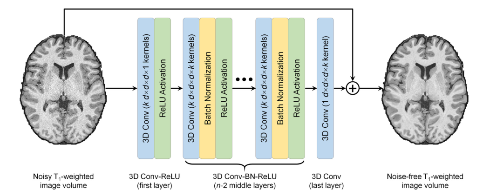
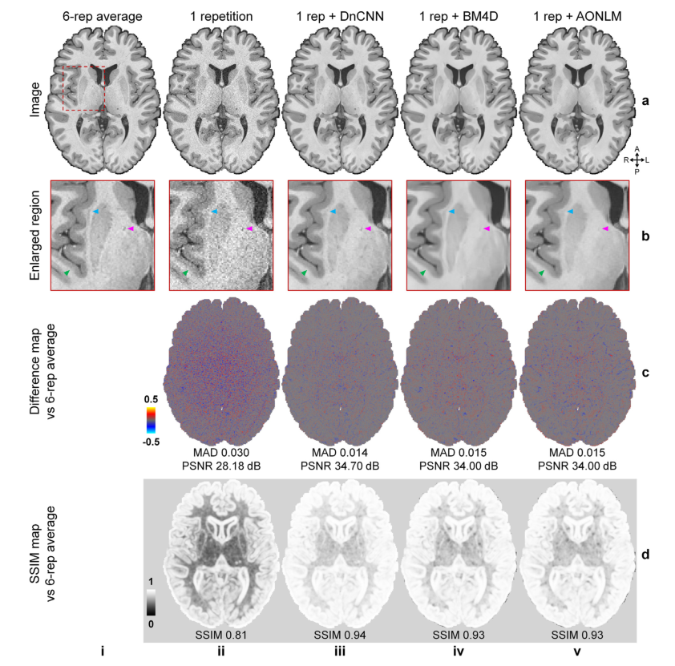

# DnSurfer Tutorial

**DnSurfer  pipeline**. The input is a noisy $T_1$-weighted image volume, and the output is the residual between noise-free $T_1$-weighted image volume and the input. DnSurfer has a simple network architecture comprised of stacked convolutional filters paired with rectified linear unit (ReLU) activation func- tions and batch normalization functions. The n -layer DnSurfer consists of a first layer of paired 3D convolution ( k kernels of size $d × d × d × 1$ voxels, stride of $1 × 1 × 1$ voxel) and ReLU activation, n − 2 middle layers of 3D convolution ( k kernels of size $d × d × d × k$ voxels, stride of $1 × 1 × 1$ voxel), batch normalization and ReLU activation, and a last 3D convolutional layer (one kernel of size $d × d × d × k$ voxels, stride of $1 × 1 × 1$ voxel). Parameter values are set n = 20, k = 64, d = 3.

**Comparison of results**. DnSurfer results recover improved signal-to-noise ratio, image sharpness, and detailed anatomical information. The denoised images from three classical denoising methods, namely DnCNN, BM4D and AONLM, have high image similarity quantified by MAD, PSNR and SSIM that are equivalent to those of T1-weighted images obtained by averaging ~2.5 repetitions of the data. Quantitative comparison can be found in the NeuroImage paper of DnSurfer.

## s_t1wSim.m

Step-by-step MATLAB tutorial for simulating the noisy images from the ground-truth data for convolutional neural network in DnSurfer. HTML file can be automatically generated using command: publish('s_t1wSim.m', 'html').

**Input**

- *data.mat*: ground-truth data

**Output**

- *data_sim.mat*: noisy images prepared for CNN

## s_DnSurfer_train.py

Step-by-step Python tutorial for training the DnSurfer using data prepared using the s_t1wSim.m script.

**Utility functions**

- *dnsurfer.py*: create DnSurfer model

- *utils.py*: create custom loss functions to only include loss within brain mask; extract blocks from whole brain volume data; normalize and denormalize image

**Output**

- *dnsurfer_ep30.h5*: DnSurfer model trained for 30 epoches
- *dnsurfer_ep30.mat*: L2 losses for the training and validation

## s_DnSurfer_apply.py

Step-by-step Python tutorial for applying the trained model to predict noise-free image.

**Utility function**

- *utils.py*

**Output**

- *data_denoise.mat*: predicted noise-free image

## compare.m

Step-by-step MATLAB tutorial for computing the whole-brain averaged MAD, PSNR, SSIM of simulated noisy images and denoised images.

**Output**

- *diff.png*: difference map with MAD and PSNR
- *SSIM.png*: SSIM map with SSIM

## **HCP data**

The example data are provided by the WU-Minn-Oxford Hhuman Connectome Project (HCP) (open access data use term at https://www.humanconnectome.org/study/hcp-young-adult/document/wu-minn-hcp-consortium-open-access-data-use-terms). Please acknowledge the source to the WU-Minn-Oxford HCP. The orginal data is available at https://www.humanconnectome.org/study/hcp-young-adult.

## **Refereces**

[1] Tian Q, Zaretskaya N, Fan Q, Ngamsombat C, Bilgic B, Polimeni JR, Huang SY. [Improved cortical surface reconstruction using sub-millimeter resolution MPRAGE by image denoising](https://www.sciencedirect.com/science/article/pii/S1053811921002238). *NeuroImage*, 2021; 223: 117946. [[**PDF**](https://doi.org/10.1016/j.neuroimage.2021.117946)]